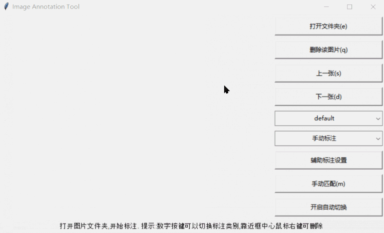

# tkImgMatchAnnotate

一个基于模板匹配的 YOLO 图像标注工具，用于验证纯视觉方法在辅助标注中的可行性。

### 核心定位
- **验证性项目**：探索传统 CV 方法在特定约束条件下的可行性
- **适用场景**：连续拍摄的图片序列
- **技术方案**：基于 OpenCV 的模板匹配，非深度学习

---

## 快速开始

### 环境准备

**方式一：使用 uv（推荐）**

```bash
# 安装依赖
uv sync

# 运行程序
uv run python main.py
```

**方式二：使用 pip**

```bash
# 安装依赖
pip install numpy opencv-python pillow

# 运行程序
python main.py
```

### 必需文件
创建 `classes.txt` 定义标注类别：
```
defect1
defect2
defect3
```

### 软件演示


---

## 完整使用流程

### Step 1: 准备阶段
1. 创建 `classes.txt` 文件，定义需要标注的类别
2. 准备待标注的图片文件夹（建议 20-100 张连续拍摄的图片）

### Step 2: 启动程序
```bash
uv run python main.py
```

### Step 3: 打开文件夹
1. 点击"打开文件夹"按钮或按 `e` 键
2. 选择包含图片的文件夹

### Step 4: 手动标注并建立模板

**重要**：在使用自动标注之前，必须先手动标注几张图片建立模板库。

1. 切换到第一张图片
2. 用鼠标左键拖拽绘制矩形框
3. 用数字键 `1-9` 选择类别
4. **保存矩形框后，程序会自动将其加载为模板**
5. 对每张图片标注 3-5 个目标

**为什么必须先手动标注？**
- 模板匹配需要"模板"才能工作
- 手动标注的结果保存后会被自动加载为模板
- 没有模板，程序无法进行自动匹配

### Step 5: 开启视觉辅助标注
1. 在右侧模式选择框中选择 **"视觉辅助标注"**
2. 程序自动加载已有模板并尝试匹配
3. 切换图片时自动进行模板匹配

> ⚠️ **注意**：当前视觉辅助标注算法尚处于开发阶段，匹配效果可能不稳定。匹配结果需要人工检查和修正。如发现匹配问题，可在匹配框上右键删除错误的匹配框以优化后续匹配效果。

### Step 6: 批量标注
标注会在以下情况触发：
- 切换到"视觉辅助标注"模式时
- 切换到下一张图片时（在视觉辅助标注模式下）
- 点击"手动匹配"按钮时

#### 方式 A：手动切换图片
- 按 `d` 键：下一张图片
- 按 `s` 键：上一张图片
- 在视觉辅助标注模式下，切换到下一张图片时会自动匹配

#### 方式 B：手动匹配
- 点击"手动匹配"按钮或按 `m` 键
- 随时可以对当前图片进行模板匹配

#### 方式 C：开启自动切换
1. 点击"开启自动切换"按钮
2. 确认后程序自动：
   - 切换到下一张图片
   - 等待 3 秒
   - 重复直到回到起点
   - 自动关闭

### Step 7: 检查与修正
- **删除错误匹配**：鼠标右键点击框内 → 选择"删除"
- **微调位置**：鼠标左键拖拽矩形框边缘调整大小

### Step 8: 完成
标签自动保存为 YOLO 格式的 txt 文件：
```
类别ID 中心点X 中心点Y 宽度 高度（全部归一化到 0-1）
```

---

## 类别文件 (classes.txt)

### 如何定义类别
创建 `classes.txt` 文件，每行一个类别名称：
```
defect1    # 第1类，数字键1选中
defect2    # 第2类，数字键2选中
defect3    # 第3类，数字键3选中
```

### 何时加载 classes.txt
| 时机 | 说明 |
|------|------|
| 程序启动 | 不加载，使用默认类别 `['default']` |
| 点击"打开文件夹"时 | 读取文件并更新下拉框 |
| 点击下拉框时 | 重新读取文件（如果已打开文件夹） |

### 中途修改 classes.txt
如果运行时修改了 `classes.txt`：
1. **不点击下拉框**：程序不会感知变化，继续使用缓存的类别
2. **点击下拉框**：重新读取文件，更新列表
3. **重新打开文件夹**：重新读取文件

**注意**：点击下拉框重新加载后，当前选中类别会重置为第一个类别。

---

## 标注模式说明

### 两种模式对比

| 模式 | 自动标注触发？ | 说明 |
|------|----------------|------|
| **手动标注** | ❌ 不触发 | 完全手动绘制 |
| **视觉辅助标注** | ✅ 触发 | 切换图片/手动匹配时自动模板匹配 |

### 切换模式
在右侧模式下拉框中选择模式：
- 切换到"视觉辅助标注"时，程序自动加载已有模板并尝试匹配
- 切换到"手动标注"时，停止自动匹配

---

## 自动切换功能

### 什么是自动切换
自动切换是一种批量处理功能，开启后程序会自动遍历文件夹中的所有图片，无需手动按键。

### 如何开启/关闭

**开启**：
1. 点击"开启自动切换"按钮
2. 确认对话框
3. 程序从当前图片开始，自动切换直到回到起点

**关闭**：
- 方式一：自动关闭（回到起点后）
- 方式二：再次点击按钮手动关闭

### 注意事项
- 自动切换时按钮和键盘会被禁用
- 如果开启了"视觉辅助标注"，每张图片都会自动匹配
- 建议先手动测试几张图片，确认匹配效果后再开启

---

## 实现原理

### 技术栈
- **GUI 框架**: Tkinter（Python 内置）
- **图像处理**: OpenCV (cv2)、PIL/Pillow
- **数值计算**: NumPy
- **构建工具**: uv

### 依赖版本
- Python >= 3.14
- numpy >= 2.4.1
- opencv-python >= 4.13.0.90
- pillow >= 12.1.0

### 核心算法
本项目使用传统计算机视觉方法，**不涉及深度学习**。

#### 1. 粗精匹配策略
- **粗匹配**：使用图像金字塔顶层快速搜索最佳旋转角度（步长 5°）
- **精匹配**：在原图上进行精确位置匹配，使用高斯模糊预处理

#### 2. 图像金字塔
- 多尺度处理，平衡速度和精度
- 自适应层级生成，根据图像尺寸自动确定金字塔层数
- 每层图像使用前进行 5x5 高斯核平滑

#### 3. 旋转模板匹配
- 0-360 度角度搜索，支持任意角度旋转
- 使用掩码排除旋转黑边，提高匹配精度
- 旋转矩阵优化，自动调整旋转中心

#### 4. 结果优化
- Otsu 自动阈值：自动计算最佳二值化阈值
- 形态学操作：9x9 核的开运算和闭运算去除噪点
- 轮廓检测：基于最大轮廓计算精确边界框
- 边界扩展：支持 5% 的边界扩展提高召回率

### 模板管理
- **最大模板数**：10 个（可调 1-30）
- **匹配阈值**：0.7（可调 0-1）
- **模板衰减**：自动降低不常用模板的权重

### 模板加载时机
模板会在以下时机自动加载：
1. **打开文件夹时**：加载文件夹中已保存的标签作为模板
2. **切换到视觉辅助标注模式时**：重新加载所有模板
3. **手动标注保存后**：将新绘制的标注框加载为模板
4. **切换到下一张图片时**（视觉辅助模式）：使用已有模板进行匹配

---

## 适用场景

### 推荐使用 ✅
- 连续拍摄的图片序列（工业检测、监控画面）
- 图片之间变化较小（位置、角度、尺寸变化不大）
- 背景相对稳定
- 目标外观高度一致

典型应用：
- 固定相机的产品质量检测
- 显微镜连续拍摄的细胞标注
- 生产线上的零件识别

### 不推荐使用 ❌
- 通用目标检测数据集（COCO、VOC）
- 目标外观变化大的场景
- 复杂背景多变的环境
- 需要多角度、多尺度标注的场景

---

## 键盘快捷键

| 按键 | 功能 |
|------|------|
| `e` | 打开文件夹 |
| `s` | 上一张图片 |
| `d` | 下一张图片 |
| `q` | 删除当前图片 |
| `m` | 手动匹配（视觉辅助模式下） |
| `1-9` | 快速切换类别 |

## 鼠标操作

| 操作 | 功能 |
|------|------|
| 左键拖拽 | 绘制新的标注框 |
| 左键靠近边缘 | 进入调整模式，调整矩形框大小 |
| 右键点击框内 | 弹出删除选项 |
| 鼠标移动 | 显示十字辅助线 |

---

## 项目结构

```
tkImgMatchAnnotate/
├── main.py              # 主程序入口和 GUI 界面
├── CustomWidgets.py     # 自定义控件（画布、状态栏、弹窗）
├── ImageProcessor.py    # 图像处理（加载、缩放、切换）
├── LabelProcessor.py    # 标签处理（YOLO 格式读写）
├── ImageMatcher.py      # 模板匹配核心算法
└── classes.txt          # 类别定义（用户创建）
```

---

## 可调参数

通过"辅助标注设置"弹窗调整：
- `max_template_num`：最大模板数量（1-30，默认 10）
- `threshold`：匹配阈值（0-1，默认 0.7）
- `higher_similarity`：是否使用较大相似度（默认 True）
- `adjust_result`：是否自动调整匹配结果（默认 True）

---

## 局限性

### 功能限制
- 仅支持矩形框标注
- 不支持中文类别名称

### 性能限制
- 旋转匹配计算量大，角度步长 5° 时性能较慢
- 模板数量过多时（>20）性能明显下降
- 对尺度变化敏感

---

**最后提醒**：这是一个验证性项目，适用于连续拍摄、变化不大的场景。如需通用标注工具，请使用 LabelImg、CVAT、Label Studio 等成熟工具。
